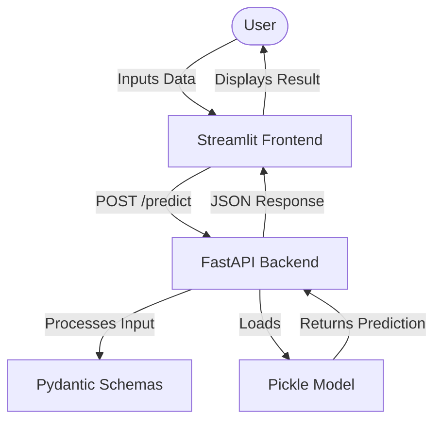

# Insurance Premium Category Predictor

This project predicts the insurance premium category for individuals based on various factors like age, weight, height, income, smoking habits, and occupation. It features a FastAPI backend for model serving and a Streamlit frontend for user interaction.

## Project Architecture



## How to Run the App

### 1. Setup Environment
Ensure you have Python 3.14 installed. It is recommended to use a virtual environment:

```bash
# Create a virtual environment
python -m venv myenv

# Activate it
# On macOS/Linux:
source myenv/bin/activate
# On Windows:
myenv\Scripts\activate
```

### 2. Install Dependencies
```bash
pip install -r requirements.txt
```

### 3. Run the Backend (FastAPI)
In one terminal, start the server:
```bash
uvicorn app:app --reload --port 8000
```

### 4. Run the Frontend (Streamlit)
In a second terminal, start the UI:
```bash
streamlit run frontend.py
```

Open your browser to `http://localhost:8501`.

## Project Structure

- `app.py`: FastAPI backend that serves the prediction model.
- `frontend.py`: Streamlit-based web interface.
- `model/`: Contains model prediction logic.
- `schema/`: Pydantic models for data validation.
- `config/`: Configuration files (e.g., city tiers).
- `Dockerfile`: Instructions for containerizing the application.
- `requirments.txt`: List of Python dependencies.

## Features

- **Backend (FastAPI)**: 
  - `/predict`: Endpoint to receive user data and return premium category.
  - `/health`: Health check endpoint.
- **Frontend (Streamlit)**: 
  - User-friendly form to input personal details.
  - Displays predicted category, confidence score, and class probabilities.

## Getting Started

### Prerequisites

- Python 3.14+
- Docker (optional)

### Installation

1. Clone the repository:
   ```bash
   git clone <repository-url>
   cd insurance-premium-prediction
   ```

2. Create and activate a virtual environment:
   ```bash
   python -m venv myenv
   source myenv/bin/activate  # On Windows: myenv\Scripts\activate
   ```

3. Install dependencies:
   ```bash
   pip install -r requirments.txt
   ```

### Running the Application

1. **Start the FastAPI backend**:
   ```bash
   uvicorn app:app --reload --port 8000
   ```

2. **Start the Streamlit frontend**:
   ```bash
   streamlit run frontend.py
   ```

## Docker Setup

To run the project using Docker:

1. Build the image:
   ```bash
   docker build -t insurance-premium-predictor .
   ```

2. Run the container:
   ```bash
   docker run -p 8000:8000 insurance-premium-predictor
   ```

